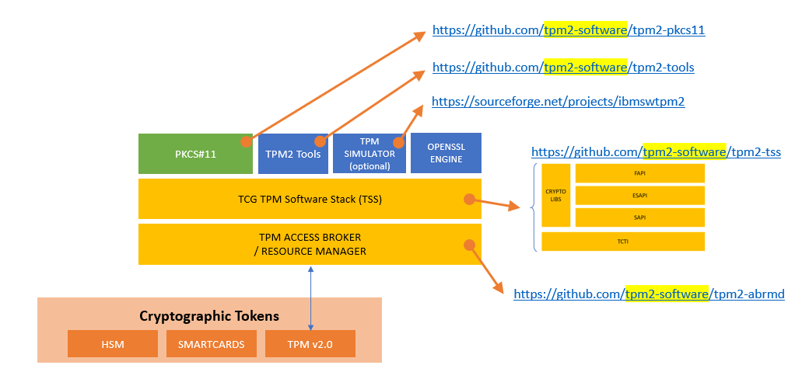

# Azure IoT Identity Service Integration

> **Disclaimer:** This repo DOES NOT contain production ready code (very limited error handling etc.) and only demonstrates the approach.

This repo demonstrates how Azure IoT Device SDKs can be used to connect to Azure IoT Hub using x509 authentication with the private key backed by an HSM.  
**Currently these samples are only tested on Linux and may or may not work on Windows**.

## Basic Idea
OpenSSL supports the notions of [dynamic engines](https://www.openssl.org/docs/OpenSSLStrategicArchitecture.html).  
> Typically engines are dynamically loadable modules that are registered with libcrypto and use the available hooks to provide cryptographic algorithm implementations. Usually these are alternative implementations of algorithms already provided by libcrypto (e.g. to enable hardware acceleration of the algorithm), but they may also include algorithms not implemented in default OpenSSL (e.g. the GOST engine implements the GOST algorithm family). Some engines are provided as part of the OpenSSL distribution, and some are provided by external third parties (again, GOST).  

We will use the *pkcs11* engine to delegate all cryptographic operations to TPM through this interface. Then we'll integrate IoT Device SDK to use that OpenSSL engine for mTLS with DPS and IoT Hub.


## Run it
The implementation is tested on *Raspberry Pi 3 B+* with the [*Infineon Optiga SLB9670 TPM 2.0*](https://www.infineon.com/cms/en/product/security-smart-card-solutions/optiga-embedded-security-solutions/optiga-tpm/slb-9670vq2.0/). OpenSSL is configured to use the PKCS11 engine with this TPM chip.  
To integrate with a different HSM you will most probably need a library from that specific vendor which supports PKCS11 on the one hand and translates those API call to the hardware specific calls on the other hand. In the following sections TPM 2.0 is used.

To run these samples, you'll need to follow these steps:
- Setup your Cloud services (DPS and IoT Hub).
- Before you can interact with the TPM through PKCS11, you'll need to install (and probably even build) a bunch of tools:  



You can find some useful scripts for building and installing the tools in [this repo](https://github.com/vslepakov/iot-edge-1.2-tpm/blob/main/step-by-step.md). Just ignore the IoT Edge part.
- Configure the OS to load the TPM chip. For the one in use, just follow [the **Hardware TPM** instructions](https://github.com/vslepakov/iot-edge-1.2-tpm/blob/main/step-by-step.md#2---install-and-configure-a-sw-or-hw-tpm). 
- Initialize! Either do it similar to [this script](https://github.com/vslepakov/iot-edge-1.2-tpm/blob/main/scripts/5-pkcs11-init.sh) or follow the instructions [here](https://github.com/tpm2-software/tpm2-pkcs11/blob/master/docs/INITIALIZING.md) and [here](https://github.com/tpm2-software/tpm2-pkcs11/blob/master/docs/PKCS11_TOOL.md).
- Install the pkcs11 OpenSSL engine ```sudo apt-get install libengine-pkcs11-openssl -y```
- Replace or merge your ```/etc/ssl/openssl.cnf``` with [this one](./openssl/tpm2-pkcs11.openssl.arm.cnf) and make sure that the MODULE_PATH is indeed correct. 
- Export paths (**make sure you use your own paths and TOKEN_NAME**) and check out the info:  
```bash
export TPM2_PKCS11_STORE='/opt/tpm2-pkcs11'
export PKCS11_LIB_PATH='/usr/local/lib/libtpm2_pkcs11.so'
export PIN=1234
export TOKEN_NAME='edge'

sudo pkcs11-tool --module $PKCS11_LIB_PATH -p $PIN -IOT
```
- Generate a key pair and a CSR:  
```bash
sudo pkcs11-tool --modul $PKCS11_LIB_PATH -p $PIN --slot=0x1 --label="device-key" --keypairgen --id 0 --key-type rsa:2048
sudo openssl req -new -subj '/CN=my-pkcs11-device/' -sha256 -config tpm2-pkcs11.openssl.arm.cnf \
 -engine pkcs11 -keyform engine -key "pkcs11:token=$TOKEN_NAME;object=device-key;type=private?pin-value=$PIN" -out my-pkcs11-device.csr
```
> NOTE: you don't need to pass in *-config* if the engine is registered in ```/etc/ssl/openssl.cnf```
- Take the CSR and request a certificate from your PKI or create one using openssl (signed by your Root CA).

### CSharp SDK
Unfortunately .NET does not seem to support working with custom OpenSSL engines ([see the GitHub issue](https://github.com/dotnet/runtime/issues/37383)) which is why I needed to fallback to native interop with **libssl**.  
[This GitHub issue](https://github.com/Azure-Samples/azure-iot-samples-csharp/issues/61) was absolutely helpful to understand what needs to be done. 

> *HINT:*  
> - Depending on the CPU architecture the path to *libssl* might need to be adapted for [here](./Device.Identity.x509/NativeMethods.cs). The path can be found using ```ldconfig -p|grep ssl```  
> - Also one needs to make sure that the OpenSSL version used by .NET corresponds to the *SafeEvpPKeyHandle.OpenSslVersion*

- Provide correct config values [here](./csharp/DeviceClient.x509/config.json)
- Excecute ```sudo dotnet run``` OR publish for your architecture (arm in my case) ```dotnet publish -r linux-arm``` and run in privileged mode ```sudo ./DeviceClient.x509```
> NOTE: you need to run this sample in privileged mode unless you do a proper permissions configuration for TPM access.  

### JavaScript SDK (Node.js)
For this SDK to work I actually needed to adapt the original [MqttBase](https://github.com/Azure/azure-iot-sdk-node/blob/be828276c3731ba5e0e944b144830fb7a126eccd/common/transport/mqtt/src/mqtt_base.ts) implementation to respect the OpenSSL engine settings (the original one requires the actual private key to be passed in). I basically extended a couple of interfaces to satisfy the TypeScript compiler and leveraged the fact that JavaScript does not care much about data types. Probably the most important change was to introduce [LINK] IClientOptionsV2 and initialize it here before it is used with the MqttProvider to connect [LINK] to IoT Hub.

- First run ```npm install``` in the **js** folder
- Compile TypeScript: ```npm run-script build```
- Run the sample like this:
```bash
sudo IOT_HUB_HOSTNAME="<YOUR_HUB_NAME>.azure-devices.net" DEVICE_ID=<YOUR_DEVICE_ID> \
 PATH_TO_CERTIFICATE_FILE="<PATH_TO_THE_PUBLIC_DEVICE_CERT_IN_PEM>" \
 KEY_IDENTIFIER="<YOUR_PKCS11_KEY_IDENTIFIER>" node simple_sample_device_x509.js
```

> NOTE: here is an example of *YOUR_PKCS11_KEY_IDENTIFIER*: pkcs11:token=edge;object=device-key;type=private?pin-value=1234